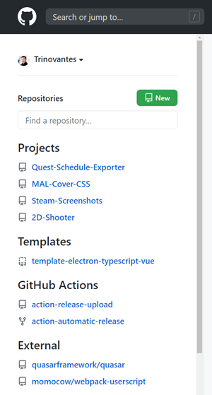

# GitHub Repository Categories

Categorizes GitHub repositories by matching repository names with regular expressions.



# Installation Guide

1. Install a Userscript manager for your web browser
    * [Greasemonkey](https://addons.mozilla.org/en-US/firefox/addon/greasemonkey/) (Firefox)
    * [Tampermonkey](https://www.tampermonkey.net/) (Chrome, Firefox, Safari, Edge)

2. [Download the latest build](https://github.com/Trinovantes/userscript-github-repository-categories/releases/download/latest/userscript-github-repository-categories.user.js). If you have Greasemonkey or Tampermonkey installed, then you should immediately be prompted with a confirmation window asking you if you wish to install this Userscript.

# Dev Guide

1. Install prereq

    * `node`
    * `yarn`
    * Tampermonkey on Chrome

2. In Chrome:
    
    * Go to `chrome://extensions/`
    * Go into Tampermonkey's details
    * Enable `Allow access to file URLs`

3. Run dev server

    ```
    yarn install
    yarn dev
    ```

4. In Tampermonkey options:

    * Go to `Utilities` tab
    * Install from URL: `http://localhost:8080/userscript-github-repository-categories.meta.js`
    * Go to `Installed Userscripts` tab
    * Open the recently installed script and add this line (change the path accordingly) inside the config headers.

        ```
        // @require file:///path\to\dist\userscript-github-repository-categories.user.js
        ```
